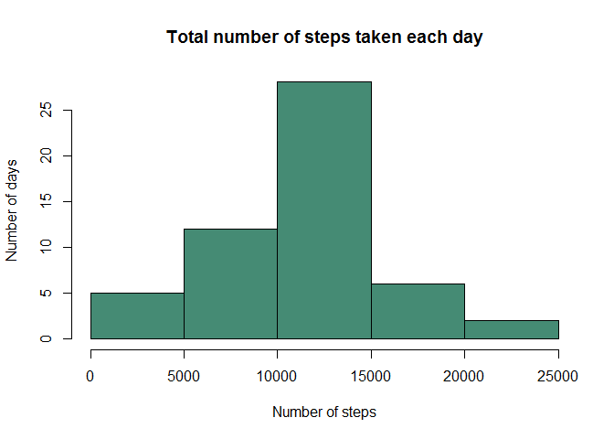
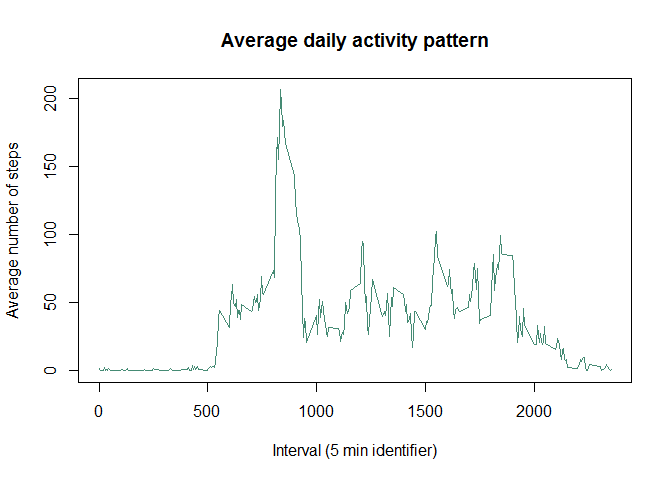
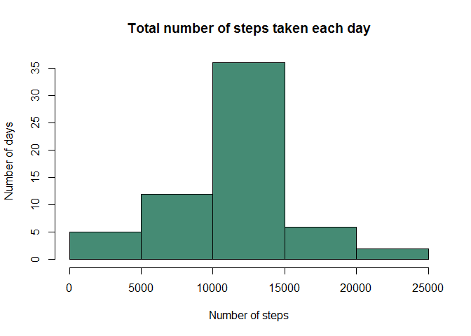
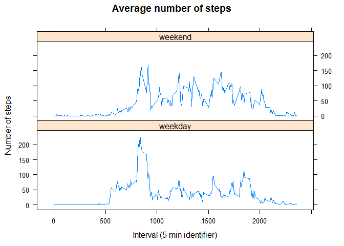

# Reproducible Research Course- Project 1 (activity.csv)
Author       : Ralston Fonseca 
Date         : 04 Sep 2018
Version      : 1.0
Description  : This is R markdown file for analysing "activity.csv" 


The data for this assignment was be downloaded from the course web site [Activity monitoring data](https://d396qusza40orc.cloudfront.net/repdata%2Fdata%2Factivity.zip) [52K]
Refer to README.md for more details.

## Loading and preprocessing the data

Following code was used to read the data from local working directory.

```r
activityDf <- read.csv("activity.csv", header = TRUE)
dim(activityDf)
```

```
## [1] 17568     3
```
It consists of *17568* observations and *3* variables.

There are roughly 13% values which are missing in *steps* variable


```r
mean(is.na(activityDf$steps))
```

```
## [1] 0.1311475
```

## What is mean total number of steps taken per day?

The missing values are ignored for plotting the histogram and getting the mean and median


```r
activityDFOmittingNA <- subset(activityDf, complete.cases(activityDf)) 

#Get the mean
dailySteps <- tapply(activityDFOmittingNA$steps,activityDFOmittingNA$date,sum, na.rm = TRUE)

# Make a histogram of the total number of steps taken each day
hist(dailySteps, xlab = "Number of steps", ylab = "Number of days", 
     main = "Total number of steps taken each day", col = "aquamarine4")
```

<!-- -->

```r
# Mean
mean(dailySteps, na.rm = TRUE)
```

```
## [1] 10766.19
```

```r
#Median
median(dailySteps, na.rm = TRUE)
```

```
## [1] 10765
```

## What is the average daily activity pattern?

The following steps takes into account the entire dataset.


1. The following graph depicts time series plot (i.e. type = "l") of the 5-minute interval (x-axis) and the average number of steps taken, averaged across all days (y-axis)


```r
# Full dataset used
avgStepsPerInterval <- tapply(activityDf$steps,activityDf$interval ,mean, na.rm = TRUE)

plot(names(avgStepsPerInterval), avgStepsPerInterval, type = "l", 
     xlab = "Interval (5 min identifier)", ylab = "Average number of steps", 
     main = "Average daily activity pattern", col = "aquamarine4")
```

<!-- -->

2. As shown below the *835*, 5-minute interval, contains the maximum number of steps on average across all the days:


```r
avgStepsPerInterval[which.max(avgStepsPerInterval)]
```

```
##      835 
## 206.1698
```

## Imputing missing values


```r
# All dates have 288 entries
table(activityDf$date) 
```

```
## 
## 2012-10-01 2012-10-02 2012-10-03 2012-10-04 2012-10-05 2012-10-06 
##        288        288        288        288        288        288 
## 2012-10-07 2012-10-08 2012-10-09 2012-10-10 2012-10-11 2012-10-12 
##        288        288        288        288        288        288 
## 2012-10-13 2012-10-14 2012-10-15 2012-10-16 2012-10-17 2012-10-18 
##        288        288        288        288        288        288 
## 2012-10-19 2012-10-20 2012-10-21 2012-10-22 2012-10-23 2012-10-24 
##        288        288        288        288        288        288 
## 2012-10-25 2012-10-26 2012-10-27 2012-10-28 2012-10-29 2012-10-30 
##        288        288        288        288        288        288 
## 2012-10-31 2012-11-01 2012-11-02 2012-11-03 2012-11-04 2012-11-05 
##        288        288        288        288        288        288 
## 2012-11-06 2012-11-07 2012-11-08 2012-11-09 2012-11-10 2012-11-11 
##        288        288        288        288        288        288 
## 2012-11-12 2012-11-13 2012-11-14 2012-11-15 2012-11-16 2012-11-17 
##        288        288        288        288        288        288 
## 2012-11-18 2012-11-19 2012-11-20 2012-11-21 2012-11-22 2012-11-23 
##        288        288        288        288        288        288 
## 2012-11-24 2012-11-25 2012-11-26 2012-11-27 2012-11-28 2012-11-29 
##        288        288        288        288        288        288 
## 2012-11-30 
##        288
```

```r
activityDFMissingSteps <- subset(activityDf, is.na(activityDf$steps)) # dim 2304 3

# All 288 values of steps are missing for these dates
table(activityDFMissingSteps$date) 
```

```
## 
## 2012-10-01 2012-10-02 2012-10-03 2012-10-04 2012-10-05 2012-10-06 
##        288          0          0          0          0          0 
## 2012-10-07 2012-10-08 2012-10-09 2012-10-10 2012-10-11 2012-10-12 
##          0        288          0          0          0          0 
## 2012-10-13 2012-10-14 2012-10-15 2012-10-16 2012-10-17 2012-10-18 
##          0          0          0          0          0          0 
## 2012-10-19 2012-10-20 2012-10-21 2012-10-22 2012-10-23 2012-10-24 
##          0          0          0          0          0          0 
## 2012-10-25 2012-10-26 2012-10-27 2012-10-28 2012-10-29 2012-10-30 
##          0          0          0          0          0          0 
## 2012-10-31 2012-11-01 2012-11-02 2012-11-03 2012-11-04 2012-11-05 
##          0        288          0          0        288          0 
## 2012-11-06 2012-11-07 2012-11-08 2012-11-09 2012-11-10 2012-11-11 
##          0          0          0        288        288          0 
## 2012-11-12 2012-11-13 2012-11-14 2012-11-15 2012-11-16 2012-11-17 
##          0          0        288          0          0          0 
## 2012-11-18 2012-11-19 2012-11-20 2012-11-21 2012-11-22 2012-11-23 
##          0          0          0          0          0          0 
## 2012-11-24 2012-11-25 2012-11-26 2012-11-27 2012-11-28 2012-11-29 
##          0          0          0          0          0          0 
## 2012-11-30 
##        288
```

```r
# 8 values missing per interval
table(activityDFMissingSteps$interval) 
```

```
## 
##    0    5   10   15   20   25   30   35   40   45   50   55  100  105  110 
##    8    8    8    8    8    8    8    8    8    8    8    8    8    8    8 
##  115  120  125  130  135  140  145  150  155  200  205  210  215  220  225 
##    8    8    8    8    8    8    8    8    8    8    8    8    8    8    8 
##  230  235  240  245  250  255  300  305  310  315  320  325  330  335  340 
##    8    8    8    8    8    8    8    8    8    8    8    8    8    8    8 
##  345  350  355  400  405  410  415  420  425  430  435  440  445  450  455 
##    8    8    8    8    8    8    8    8    8    8    8    8    8    8    8 
##  500  505  510  515  520  525  530  535  540  545  550  555  600  605  610 
##    8    8    8    8    8    8    8    8    8    8    8    8    8    8    8 
##  615  620  625  630  635  640  645  650  655  700  705  710  715  720  725 
##    8    8    8    8    8    8    8    8    8    8    8    8    8    8    8 
##  730  735  740  745  750  755  800  805  810  815  820  825  830  835  840 
##    8    8    8    8    8    8    8    8    8    8    8    8    8    8    8 
##  845  850  855  900  905  910  915  920  925  930  935  940  945  950  955 
##    8    8    8    8    8    8    8    8    8    8    8    8    8    8    8 
## 1000 1005 1010 1015 1020 1025 1030 1035 1040 1045 1050 1055 1100 1105 1110 
##    8    8    8    8    8    8    8    8    8    8    8    8    8    8    8 
## 1115 1120 1125 1130 1135 1140 1145 1150 1155 1200 1205 1210 1215 1220 1225 
##    8    8    8    8    8    8    8    8    8    8    8    8    8    8    8 
## 1230 1235 1240 1245 1250 1255 1300 1305 1310 1315 1320 1325 1330 1335 1340 
##    8    8    8    8    8    8    8    8    8    8    8    8    8    8    8 
## 1345 1350 1355 1400 1405 1410 1415 1420 1425 1430 1435 1440 1445 1450 1455 
##    8    8    8    8    8    8    8    8    8    8    8    8    8    8    8 
## 1500 1505 1510 1515 1520 1525 1530 1535 1540 1545 1550 1555 1600 1605 1610 
##    8    8    8    8    8    8    8    8    8    8    8    8    8    8    8 
## 1615 1620 1625 1630 1635 1640 1645 1650 1655 1700 1705 1710 1715 1720 1725 
##    8    8    8    8    8    8    8    8    8    8    8    8    8    8    8 
## 1730 1735 1740 1745 1750 1755 1800 1805 1810 1815 1820 1825 1830 1835 1840 
##    8    8    8    8    8    8    8    8    8    8    8    8    8    8    8 
## 1845 1850 1855 1900 1905 1910 1915 1920 1925 1930 1935 1940 1945 1950 1955 
##    8    8    8    8    8    8    8    8    8    8    8    8    8    8    8 
## 2000 2005 2010 2015 2020 2025 2030 2035 2040 2045 2050 2055 2100 2105 2110 
##    8    8    8    8    8    8    8    8    8    8    8    8    8    8    8 
## 2115 2120 2125 2130 2135 2140 2145 2150 2155 2200 2205 2210 2215 2220 2225 
##    8    8    8    8    8    8    8    8    8    8    8    8    8    8    8 
## 2230 2235 2240 2245 2250 2255 2300 2305 2310 2315 2320 2325 2330 2335 2340 
##    8    8    8    8    8    8    8    8    8    8    8    8    8    8    8 
## 2345 2350 2355 
##    8    8    8
```

```r
nmissing <- nrow(activityDFMissingSteps)
```
1) The total rows with missing values are: 2304

2) As shown above the entire set for that *date* is missing so I have decided to fill missing values by *interval*. Also the using *median* will skew the data on the lower side as there considerable values with 0 steps for higher intervals. Hence I have decided to use *mean of steps for an interval* to fill the missing values.

3) Creating a new dataset to fill the missing values. Values are rounded to lower integer value.


```r
# Create new dataset
activityFilledNA <- activityDf

# fill the missing values with mean of steps for an interval
for (i in activityFilledNA$interval) {
    activityFilledNA[which( activityFilledNA$interval == i & 
                                is.na(activityFilledNA$steps)),"steps"] <- 
        round(avgStepsPerInterval[names(avgStepsPerInterval) == i])
}
```

4) Plotting histogram and calculating mean and median using filled up values for missing data.


```r
dailySteps2 <- tapply(activityFilledNA$steps,activityFilledNA$date,sum, na.rm = TRUE)


# Make a histogram of the total number of steps taken each day
hist(dailySteps2, xlab = "Number of steps", ylab = "Number of days", 
     main = "Total number of steps taken each day", col = "aquamarine4")
```

<!-- -->

```r
# Calculate mean
mean(dailySteps2, na.rm = TRUE)
```

```
## [1] 10765.64
```

```r
# Calculate median
median(dailySteps2, na.rm = TRUE)
```

```
## [1] 10762
```

As we see the *mean* and *median* values have reduced slightly but are still close based on the above strategy.

## Are there differences in activity patterns between weekdays and weekends?

Create extra column *weekday* to categorise the row as *weekday* or *weekend*.
Using *lattice* package to create the plot.


```r
library(lattice)

activityFilledNA$weekday <- ifelse(weekdays(as.Date(activityFilledNA$date)) %in% c("Saturday", "Sunday"), "weekend", "weekday")

avgSPI <-aggregate(steps ~ weekday + interval,data = activityFilledNA, FUN = mean )

xyplot(steps ~ interval | weekday, data = avgSPI, type = "l", layout = c(1, 2),
       xlab = "Interval (5 min identifier)", ylab = "Number of steps",
       main = "Average number of steps")
```

<!-- -->
